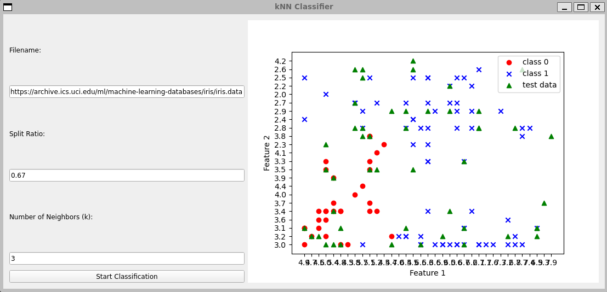

# knn classifier from scratch

## Description
This Github repository is about creating the K-Nearest Neighbor (KNN) algorithm from scratch.
 The code uses the iris dataset which is commonly used for testing machine learning algorithms. 

## Execution
1. Clone this repository to your local machine using the command: `git clone https://github.com/[your-username]/knn-iris-classifier.git`
2. Make sure you have Python and required libraries (csv, random, math, operator) installed on your machine. 
3. Navigate to the repository using the command line.
4. Execute the code using the command `python knn.py` 
5. The code will perform the following steps:
    - Load the Iris dataset from the file 'iris.data'
    - Split the dataset into training and testing sets using the split value (0.67)
    - Train the KNN algorithm on the training set
    - Use the trained algorithm to generate predictions on the test set
    - Measure the accuracy of the predictions
    - Display the accuracy and predictions.

